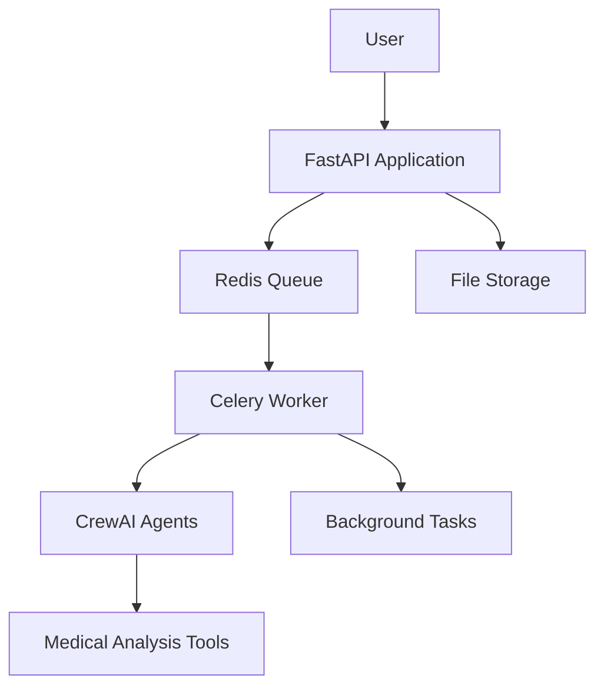

# Blood Test Report Analyzer with Queue System

A **FastAPI-based** application that analyzes blood test reports using **CrewAI agents** and a **Redis queue system** for handling concurrent requests.

---

## 🐛 Bugs Found and Fixes Applied

A summary of critical issues encountered during development and the fixes applied:

### 1. Missing LLM Configuration in `agents.py`

* **Bug**: `llm = llm` caused an undefined variable error.
* **Fix**: Added proper LLM configuration using OpenAI or Gemini setup.

### 2. Incorrect File Path Handling

* **Bug**: Tasks were not receiving the `file_path` parameter properly.
* **Fix**: Updated task descriptions to correctly use the `{file_path}` placeholder.

### 3. Circular Import Issues

* **Bug**: `main.py` imported `task.py`, which imported `agents.py`, creating a circular dependency.
* **Fix**: Restructured imports and isolated critical logic by duplicating necessary functions in `worker_tasks.py`.

### 4. Missing Tools Implementation

* **Bug**: `tools.py` contained placeholder task definitions instead of real functional tools.
* **Fix**: Created proper tool classes like `BloodTestReportTool`, `NutritionTool`, etc.

### 5. Malicious or Satirical Code

* **Bug**: Task descriptions included fake or harmful medical advice.
* **Fix**: Replaced descriptions with real-world, professional, and ethical medical analysis tasks.

### 6. Missing Dependencies

* **Bug**: `requirements.txt` was missing crucial PDF and text-processing libraries.
* **Fix**: Added necessary packages like `PyMuPDF`, `pdfminer.six`, `pydantic`, etc.

### 7. Agent Configuration Issues

* **Bug**: Agents had incorrect or missing tool assignments and lacked clear roles.
* **Fix**: Properly defined agents with their tools, goals, and backstories in alignment with medical task flows.

### 8. Task Output Specifications

* **Bug**: Outputs were misleading and encouraged unverified or unsafe medical interpretations.
* **Fix**: Redesigned output expectations to reflect structured, safe, and professional analysis results.

---

## 🚀 Setup Instructions

### 🛠️ Prerequisites

Make sure you have the following installed:

* [Python 3.11+](https://www.python.org/downloads/)
* [Redis server](https://redis.io/) (Docker handles it if you're using Docker Compose)
* [Docker + Docker Compose](https://www.docker.com/) (recommended)
* [Ollama](https://ollama.com/) for running local language models

---

## 🐳 Method 1: Docker Compose (Recommended)

### Step 1: Clone the Repository

```bash
git clone https://github.com/jankigabani/blood-test-analyzer-debug.git
cd blood-test-analyzer-debug
```

### Step 2: Environment Configuration

Create a `.env` file in the root directory:

```env
REDIS_URL=redis://redis:6379/0
SERPER_API_KEY=your_serper_api_key_here
OLLAMA_HOST=host.docker.internal:11434
```

### Step 3: Setup Ollama

```bash
# Install and start Ollama
ollama serve

# Pull the required model
ollama pull llama3.1
```

### Step 4: Start the Application Stack

```bash
docker-compose up --build
```

This will start:

* FastAPI server (port 8000)
* Celery worker for background processing
* Redis for task queue (port 6379)
* Flower monitoring dashboard (port 5555)

### Step 5: Verify Installation

* API Documentation: [http://localhost:8000/docs](http://localhost:8000/docs)
* Health Check: [http://localhost:8000/](http://localhost:8000/)
* Flower Dashboard: [http://localhost:5555](http://localhost:5555)

---

## 💻 Method 2: Local Development Setup

### Step 1: Clone and Setup Environment

```bash
git clone https://github.com/jankigabani/blood-test-analyzer-debug.git
cd blood-test-analyzer-debug

# Create virtual environment
python -m venv venv
source venv/bin/activate  # On Windows: venv\Scripts\activate
```

### Step 2: Install Dependencies

```bash
pip install -r requirements.txt
```

### Step 3: Environment Configuration

Create a `.env` file:

```env
REDIS_URL=redis://localhost:6379/0
SERPER_API_KEY=your_serper_api_key_here
OLLAMA_HOST=http://localhost:11434
```

### Step 4: Start Services Individually

* Terminal 1: Start Redis

```bash
# Using Docker
docker run -d -p 6379:6379 redis:7-alpine

# Or install Redis locally and run
redis-server
```

* Terminal 2: Start Ollama and Model

```bash
ollama serve
ollama pull llama3.1
```

* Terminal 3: Start Celery Worker

```bash
celery -A celery_app worker --loglevel=info --concurrency=2
```

* Terminal 4: Start FastAPI Application

```bash
uvicorn main:app --host 0.0.0.0 --port 8000 --reload
```

* Terminal 5: Start Flower (Optional)

```bash
celery -A celery_app flower --port=5555
```

---

## 📚 API Documentation

### Base URL

[http://localhost:8000](http://localhost:8000)

### 🔗 Endpoints

#### 1. Health Check

**GET /**

```json
{
  "message": "Blood Test Report Analyser API with Queue is running",
  "queue_status": "Available",
  "endpoints": {
    "analyze": "POST /analyze - Queue analysis job",
    "status": "GET /status/{task_id} - Check job status",
    "result": "GET /result/{task_id} - Get analysis result"
  }
}
```

#### 2. Analyze Blood Report

**POST /analyze**

* **Parameters**:

  * `file` (multipart/form-data): PDF blood test report (required)
  * `query` (form): Analysis query (optional, default: "Summarise my Blood Test Report")

**Response**:

```json
{
  "status": "queued",
  "task_id": "550e8400-e29b-41d4-a716-446655440000",
  "message": "Analysis job queued successfully",
  "check_status_url": "/status/550e8400-e29b-41d4-a716-446655440000",
  "get_result_url": "/result/550e8400-e29b-41d4-a716-446655440000"
}
```

**cURL Example**:

```bash
curl -X POST "http://localhost:8000/analyze" \
  -F "file=@data/blood_test_report.pdf" \
  -F "query=Analyze my cholesterol and blood sugar levels"
```

#### 3. Check Task Status

**GET /status/{task\_id}**

**Response (Processing)**:

```json
{
  "task_id": "...",
  "state": "PROCESSING",
  "status": "Processing blood report...",
  "progress": 25
}
```

**Response (Completed)**:

```json
{
  "task_id": "...",
  "state": "SUCCESS",
  "status": "Analysis completed successfully",
  "progress": 100,
  "result_available": true
}
```

#### 4. Get Analysis Result

**GET /result/{task\_id}**

```json
{
  "status": "SUCCESS",
  "query": "Analyze my cholesterol levels",
  "analysis": "Based on your blood test report analysis...",
  "file_processed": "blood_report.pdf",
  "task_id": "..."
}
```

#### 5. Queue Statistics

**GET /queue/stats**

```json
{
  "queue_length": 2,
  "worker_stats": {...},
  "active_tasks": {...}
}
```

---

## 🔧 Architecture

### System Components



### Workflow

1. **Upload**: User uploads blood test PDF via `/analyze`
2. **Queue**: File saved with unique ID, task queued in Redis
3. **Process**: Celery worker processes it with CrewAI
4. **Monitor**: User checks `/status/{task_id}`
5. **Results**: User retrieves analysis via `/result/{task_id}`
6. **Cleanup**: Files auto-deleted after 1 hour

---

## 🧪 Testing

### Quick Test Commands

1. **Upload and Analyze**

```bash
curl -X POST "http://localhost:8000/analyze" \
  -F "file=@data/sample_blood_report.pdf" \
  -F "query=Provide comprehensive health analysis"
```

2. **Check Processing Status**

```bash
curl "http://localhost:8000/status/TASK_ID_HERE"
```

3. **Retrieve Results**

```bash
curl "http://localhost:8000/result/TASK_ID_HERE"
```

---

## 🔍 Monitoring and Debugging

### Access Points

* API Documentation: [http://localhost:8000/docs](http://localhost:8000/docs)
* Flower Dashboard: [http://localhost:5555](http://localhost:5555)
* Queue Stats: [http://localhost:8000/queue/stats](http://localhost:8000/queue/stats)
* Health Check: [http://localhost:8000/](http://localhost:8000/)

### Logging

```bash
# Application logs
docker-compose logs -f api

# Worker logs
docker-compose logs -f worker

# All logs
docker-compose logs -f
```

---

## 🌟 Features Implemented

### ✅ Core Features

* FastAPI REST API
* PDF blood report processing
* CrewAI multi-agent analysis
* Professional medical insights

### ✅ Queue System (Bonus)

* Redis task queue
* Celery background workers
* Task status tracking
* Result caching
* Flower monitoring dashboard

### ✅ Production Ready

* Docker containerization
* Environment configuration
* Error handling and logging
* File cleanup automation
* Health check endpoints

---

Created with ❤️
